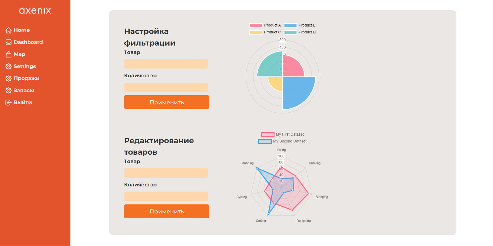
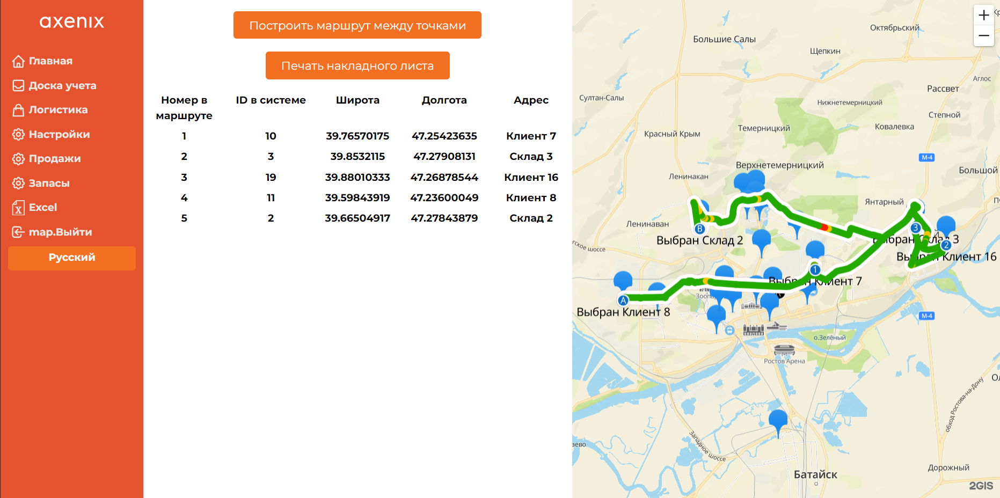

# Pepper coding hackaton

## Выполнение требований

### Дэшборды со статистикой

```plaintext
Интерфейс управления запасами:
Создание Dashboard для визуального отображения текущего состояния запасов на складах и в точках продаж 
с использованием диаграмм и графиков.
Визуализация данных о продажах, позволяющая отслеживать динамику продаж и остатки товаров на складе.
Внедрение функционала для управления запасами, включая настройку оповещений о необходимости пополнения запасов или 
предупреждений об их избытке, с возможностью ручной коррекции уровней запасов
```



Каждый такой раздел доступен по системе ролей только админу, все контролируется Next, поэтому проблем с безопасностью нет

Здесь мы можем управлять доступом сотрудников, следить за запасами на складе (следить за просрочкой, товарами, у которых скоро истекает срок годности, изучать средний вес, следить за доставкой)

### Система ролей

```plaintext
Разработка системы ролей и доступов: *
Определение и настройка ролей пользователей в системе, включая администраторов, логистов, 
аналитиков и персонал склада;
Назначение прав доступа для каждой роли, обеспечивая соответствующий уровень контроля над функциями системы;
Разработка интерфейса для управления ролями и правами доступа, 
позволяющего администраторам изменять и назначать роли пользователей;
Интеграция системы аутентификации и авторизации для обеспечения безопасного доступа 
к функционалу в соответствии с ролями пользователя;
Тестирование механизмов доступа и безопасности для верификации правильности настройки ролей и доступов.
```

Система  ролей реализована: есть 2 образующие роли ADMIN и USER. На этапе отдачи Next'ом HTML файла в layout мы проверяем соответствие ролей, при несоответствии происходит редирект на главную еще со стороны сервера (Next)

### Карта

```plaintext
Интерактивная карта для маршрутизации:
Разработка карты с использованием JavaScript-библиотек, 
таких как Google Maps API или Яндекс Карты API, для визуализации точек продаж и складов.
Отображение оптимальных маршрутов доставки, созданных на основе алгоритмов маршрутизации, 
с возможностью их визуализации через линии или маркеры.
Реализация функции фильтрации маршрутов по различным параметрам, 
например, по длительности пути, типу товаров или приоритету заказа.
```

Мы использовали карты от 2ГИС

Достоинства 2ГИС:

1) У них одна из самых богатых статистик
2) Это продукт от отечественного IT-гиганта, у команда было желание использовать именно отечественного провайдера, например, поэтому вбыор пал не на Google Maps
3) По сравнению с Яндексом у них блистательная API и библиотека взаимодействия с API - @2gis/mapgl и @2gis/mapgl/types

   Для кратчайшего нахождения пути  с учетом характеристик товара (например, срокгодности) мы использовали  Муравьиный Алгоритм, так как в его основе лежит как раз таки ориентировка на разные веса, муравьи ходят по феромонам (срок годности, срочность и другие факторы усиливают феромоны - как бы вес ребр)

После построения маршрута можно экспортировать pdf файл с накладной по маршруту, как надо ехать, который выглядит следующий образом:



### Прогнозирование

Данный этап находится на этапе разработки, создан алгоритм A* Star для нахождения путей. Необходимо интегрировать совместно с Frontend

### Таблицы

Реализованы импорт и экспорт Excel файлов с помощью xlsx

### Перевод

Абсолютно все переведено на английский и русский - мы уважаем всех сотрудников компании, которые говорят не на русском 

Интернационализирован даже PDF и Excel!

### ER-Диаграмма


### Документация Backend

Swagger: http://ilshaw.site/api/swagger

### Технические моменты

#### Frontend Стек

* Next 14 (+React)
* @2gis/mapgl - API 2GIS
* sheet.js
* Tailwindcss
* typescript
* chart.js
* next-intl (Аналог i18n)

#### FSD

FSD - это архитектурная методология построения интерфейсных приложений. Проще говоря, это сборник правил и условностей по организации кода. Основная цель этой методологии - сделать проект более понятным и структурированным в условиях относительно большой команды

Данная методология была избрана, так как в фронтенд команде 3 человека, и для понятной работы нужна железная методология (а с ней приходит и архитектура веб приложения)

В FSD есть аспект шаблонности, поэтому дополнительно для скорости и уменьшения рутинности были разработаны скрипты (в папке scripts - createSlice). С помощью этой утилиты мы созвавали слайлсы для entities, pages (в данном контексте Next'а они в app), widgets. На самом деле, очень полезно и продуктивная, сэкономила силы + время

#### Цифры

Всем известно, что взрослые любят цифры. У нас 4000 строк кода - постарались:)

Посчитали благодаря расширению браузера Github Gloc


